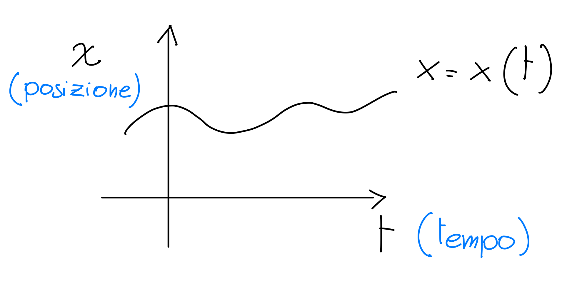
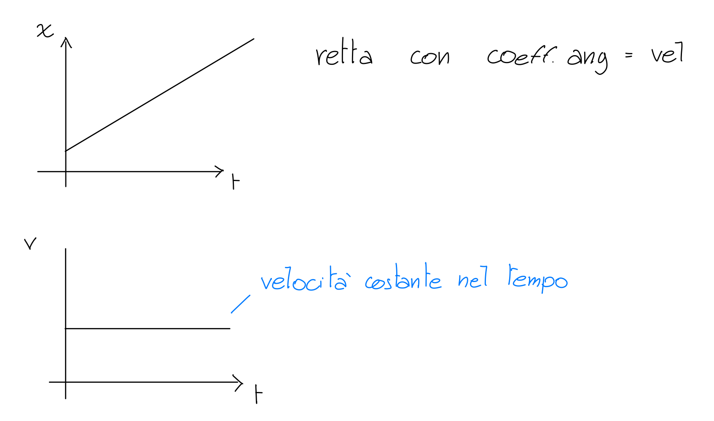

## Fisica parte 1 - CINEMATICA

**RISULTATO DI MISURA**: $ x + \Delta x $

$x$ = valore di misura

$\Delta x$ = incertezza di misura

**MISURA INDIRETTA** $ Y = F(X_1, X_2, ... , X_n) $

$Y$ = grandezza derivata

$F$ = funzione

$X_1, X_2, ... , X_n$ = grandezze fisiche

**GRANDEZZE FONDAMENTALI**:

| Grandezza | Unità di misura | Simbolo |
| --- | --- | --- |
| Massa | chilogrammo | kg |
| Lunghezza | metro | m |
| Tempo | secondo | s |
| Temperatura | kelvin | K |
| Quantità di sostanza | mole | mol |
| Intensità di corrente | ampere | A |
| Intensità luminosa | candela | cd |

**CALCOLO DIMENSIONALE**:

omogenee = stesse dimensioni

- $A = B\ \iff\ [A] = [B]$ omogenee
- $A+B\ \iff\ [A] = [B]$ omogenee
- $[A\cdot B]\ \iff\ [A]\cdot[B]$ prodotto di dimensioni
- $[\Pi] \iff 1$ costanti sono adimensionali

**CIFRE SIGNIFICATIVE**:

$S: (97 \pm 1)m$

$\Delta T = (22 \pm 1)m$

| $ S \Delta T $ | 21 | 23 |
| --- | --- | --- |
| 96 | 4.571... | 4.173... |
| 98 | 4.619... | 4.217... |

$Vm$ varia da 4.619 - 4.173 = 0.446

**errore massimo assoluto**:

$Vm = (4.409... \pm 0.223...) m/s$

$ Vm = (4.4 \pm 0.2) m/s$

$0.2$ ordine grandezza errore

**NOTAZIONE SCIENTIFICA ED ERRORI**:

$250 \pm 10$ &rarr; $(2.50 \pm 0.10) \cdot 10^2$

$30.0 \pm 0.2$ &rarr; $(3.00 \pm 0.02) \cdot 10^1$

$0.0005 \pm 0.001$ &rarr; $(5 \pm 1) \cdot 10^{-3}$

**CIFRE SIGNIFICATIVE OPERAZIONI**:

- **SOMMA**: $A=2.5 \cdot 10^2 , B=30.0$ &rarr; $ A+B = 2.8 \cdot 10^2 $

  notare ordine di grandezza di $A$ sono le decine, di $B$ sono i decimi

- **PRODOTTO**: $A=2.5 \cdot 10^2 , B=30.0$ &rarr; $ A\cdot B = 7.5 \cdot 10^3 $

  notare che $A$ ha 2 cifre significative, $B$ ne ha 3, quindi il risultato avrà 2 cifre significative

- **FUNZIONE UNARIA**: $A=2.5 \cdot 10^2$ &rarr; $ \sqrt{A} = 1.6 \cdot 10^1 $

  notare che $A$ ha 2 cifre significative, quindi il risultato avrà 2 cifre significative

### CINEMATICA

**CINEMATICA**: descrizione del moto dei corpi

**POSIZIONE**: relativa a un PUNTO DI RIFERIMENTO

**ASSE COORDINATO**:

$P = x = \vec{OP}$

$ \vert \vec{OP'} \vert = \vert \vec{OP} \vert $

$ x \text{ posizione} \begin{cases} \vert \vec{OP} \vert \text{ se } \vec{OP}  \text{ concorde nel verso positivo} \\\\ - \vert \vec{OP} \vert \text{ se } \vec{OP} \text{ discorde nel verso positivo} \end{cases} $

**DUE DIMENSIONI**:

#### LEGGE ORARIA DEL MOTO

descrive la posizione in un dato istante

#### MOTO RETTILINEO UNIFORME

intervalli di tempo uguali = spostamenti uguali

LEGGE ORARIA:

$$x(t) = At + x_0$$

$x_0$: posizione iniziale

$t$: istante di tempo

$A$: costante di proporzionalità

$n\Delta x=A \cdot n\Delta t$ &nbsp; &nbsp; con $n$ numero di istanti

VELOCITÀ MEDIA: $$v_m = \frac{\Delta x}{\Delta t}$$

VELOCITÀ ISTANTANEA: $$v = \lim_{\Delta t \to 0} \frac{\Delta x}{\Delta t}$$

#### MOTO RETTILINEO UNIFORMEMENTE ACCELERATO

accelerazione costante, velocità aumenta linearmente

$v(t) = Bt + v_0$

$a_m = \frac{\Delta v}{\Delta t}$

$v(t) = a_m t + v_0$

**ACCELERAZIONE MEDIA**: $$a_m = \frac{\Delta v}{\Delta t}$$

**ACCELERAZIONE ISTANTANEA**: $$a(t) = \lim_{\Delta t \to 0} \frac{\Delta v}{\Delta t} = \frac{dv(t)}{dt}$$

 

#### IN BREVE

**SPAZIO**: legge oraria $x = x(t)$

**VELOCITÀ**: derivata della legge oraria $v = \frac{dx}{dt}$

**ACCELERAZIONE**: derivata della velocità $a = \frac{dv}{dt} = \frac{d^2x}{dt}$

#### INTERLUDIO MATEMATICO

#### MOTO RETTILINEO UNIFORMEMENTE ACCELERATO

**1 dimensione**:

| 1 dimensione | |
| --- | --- |
| legge oraria: | $$ x(t) = \frac{1}{2} a_0 t^2 + v_0 t + x_0 $$ |
| velocità: | $$ v(t) = a_0 t + v_0 $$ |
| accelerazione: | $$ a(t) = a_0 $$ |

**2 dimensioni**:

| 2 dimensioni | |
| --- | --- |
| legge oraria: | $$ \vec{r}(t) = \frac{1}{2} \vec{a_0} t^2 + \vec{v_0} t + \vec{r_0} $$ |
| velocità: | $$ \vec{v}(t) = \vec{a_0} t + \vec{v_0}$$ |
| accelerazione: | $$ \vec{a}(t) = \vec{a} $$ |

scegliamo asse y parallelo ad $a_0$