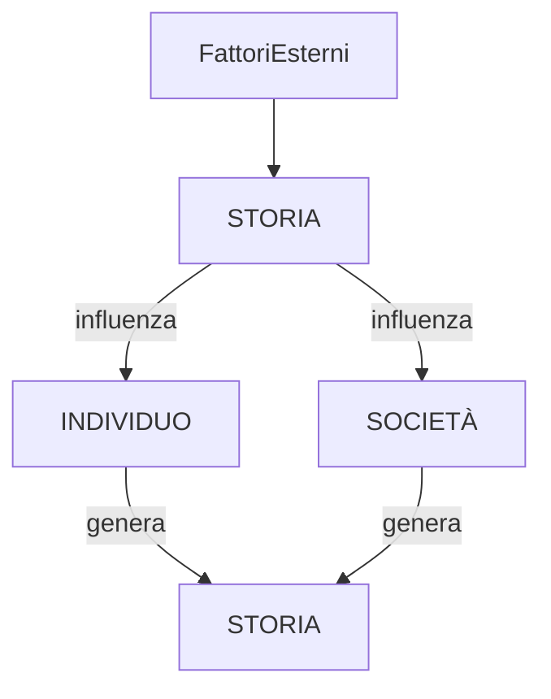
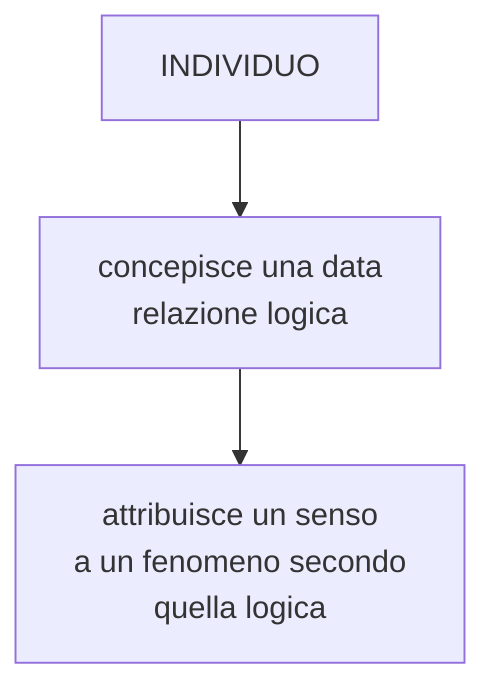
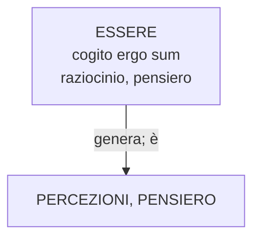

## 13/11/2019

Nota subito successiva a quella precedente.

Già dal primo appunto rilevo come per me il sistema sociale è costruito dalla società stessa. La rilevanza degli individui all'interno della mia visione si è mantenuta, anzi è stata corroborata da esperienza e studi. Si potrebbe sintetizzare tutto con uno schema



(da sistemare)

Io personalmente credo nella scienza, l'unico nostro sapere dimostrato e ritenuto valido. Il metodo scientifico è il nostro metodo per determinare ciò che si sa o meno in termini di "sapere" e "visione del mondo".
Pertanto in assenza di dimostrazioni, di altri livellli di esistenza, ritengo opportuno pensare che l'uomo sia un'entità puramente chimico-biologica.

Tutto ciò che esiste in quanto percepito (sensazione, comportamento...) ma non è ancora stato eviscerato in maniera _esatta_ dalla scienza (in chiave causa-effetto o in chiave biologica) lo assimilo come parte indeterminata dell'uomo. Essa è determinante per comprendere il comportamente umano, ma non ci è dato sapere in che modo si sviluppa ed è influenzata dal contesto.

La storia (ovvero gli stati della realtà in senso assoluto) determinano una condizione di partenza per gli individui. Gli individui pertanto hanno le seguenti caratteristiche:

- UN CONTESTO ESTERNO
- UN'ESSENZA BIOLOGICA INTERNA

Il contesto esterno (cioè TUTTO ciò che non è individuo) agisce determinando lo sviluppo dell'individuo secondo la reazione biologica determinata e indeterminata di quest'ultimo.

Gli individui si approcciano agli altri medianti comportamente collettivi e modelli di interazione che sono influenzati dalla STORIA (ovvero i modelli della società in cui nascono) ma non è detto che siano identici perché la risposta biologica dell'individuo è mutevole (esempio: può assumere comportamenti DEVIANTI); pertanto l'individuo ha la facoltà di modificare la società. Nel caso in cui il comportamento alternativo si diffonda tra molti individui ecco allora che nasce un nuovo modello sociale che influenzerà altri individui. Poiché la parte indeterminata dell'uomo risponde in maniera non nota agli stimoli, ogni evento o ogni atto è potenzialmente in grado di influenzare in maniera determinante le azioni di un individuo, che potrebbero a loro volta agire con effetti ignoti su altri individui, generando un mutamento sociale.

L'individuo è enormemente responsabile della storia. Allo stesso modo l'uomo è enormemente vittima della stessa, perché ne è influenzato fin nel profondo.

> OGNI INDIVIDUO È VITTIMA E RESPONSABILE DEL CORSO DELLA STORIA IN MANIERA ASSOLUTAMENTE RILEVANTE MA INDETERMINATA

Dato questo principio banale quali sono le implicazioni sull'analisi dell'individuo e della società

- la vita NON ha un senso, NON esistono il bene o il male
- Non ci è dato sapere se esista o meno il libero arbitrio
- l'individuo è centrale per la società e viceversa

## Sul senso della vita

1) Il senso non c'è, ovvero non ha proprietà di esistenza/sussistenza in termini ontologici
2) Il senso tuttavia è una condizione/interpretazione attribuibile a un dato fenomeno frutto di una relazione logica dell'individuo



&rarr; pertanto se non c'è un ente capace di attribuire senso esso non c'è.

esempio: In un sistema isolato composto solo di sassi e oggetti inanimati, se si sviluppa una stella, che senso ha?
Nessuno, poiché è privo di elementi in grado di attribuirlo.

&rarr; il senso è puramente individuale e contigente, lo genera l'individuo.

&rarr; il senso non è una causa a priori degli eventi, ma può essere causa a posteriori dopo che venga generato da un individuo

## Realtà (16/11/2019)

&rarr; cosa posso assumere che sia reale e cosa non lo sia? Domanda complessa.
Cartesio aveva individuato il "cogito ergo sum" &rarr; solo il pensiero è certo &rarr; tuttavia ciò che noi immaginiamo e percepiamo è pensiero &rarr; per cui esiste.

Dipende da cosa intendiamo per esistenza e per realtà.
Cosa significa realtà oggettiva? Ogni cosa che noi vediamo (presupponendo che la realtà sia l'esterno all'individuo) è una rappresentazione di un ente. Tuttavia NON è l'ente. Ad esempio i colori sono il risultato di una selezione di onde emesse da un oggetto. ma di fatto esistono anche altre onde che fan parte dell'oggetto.
&rarr; i nostri sensi percepiscono PARTE della REALTÀ, quindi distorta. Ciò significa che la realtà non può essere oggettiva in base ai sensi. Tuttavia ciò che analizzo indipendentemente dai sensi (es. METODO SCIENTIFICO) lo percepisco in base ai sensi. I risultati di una misura la leggo con gli occhi per cui anche quella potrebbe essere una distorsione. Però per il cogito ergo sum i miei pensieri e le mie percezioni esistono, esiste un ente che lo genera. Per cui esse sono reali.
Un sogno è realtà, lo percepisco. Tuttavia non è realtà tattile. Per esempio un sogno non interagisce direttamente con l'ambiente. Ma entrambi sono percepiti, quindi esistono.

Ciò determina che più che di realtà o irrealtà bisognerebbe parlare di livello di esistenza.

I miei sogni sono di diverso livello di esistenza rispetto alla realtà percettiva.

## Cattiveria e Malvagità

L'uomo non è malvagio. La malvagità in sé non esiste. Un individuo sceglie SEMPRE quello che preferisce. Non fosse così sarebbe paradossale, non l'avrebbe scelto.

esempio: $X$ deve scegliere tra

- $y$ = andare a diversi con gli amici
- $z$ = studiare per un esame

$X$ sa che se sceglie $y$ sua madre si arrabbia e lo mette in punizione. Poiché la paura della mamma è superiore all'utilità generata da $y$; egli preferisce $z$.

Se un individuo sceglie sempre ciò che ritiene MIGLIORE, come può essere cattivo? Non può.

L'unico modo in affinché un uomo sia considerabile cattivo è che un soggetto attribuisca ad un altro individuo lo stato di cattivo.

Tornando all'esempio di prima, se $W$ doveva uscire con $X$, ma questo sceglie $z$, allora $W$ darà a $X$ l'attributo di cattiveria. $X$ può concordare con $W$, giudicandosi cattivo, ma lui per sé stesso non lo è stato: per lui la cattiveria sarebbe stato scegliere $y$.

Esempio 2:
$X$ deve scegliere tra $y$ = merendina e $z$ = insalata. $x$ sceglie sempre $y$ pu sapendo che ingrasserà. $X$ continuerà a scegliere $y$ finché un giorno si guarda davanti allo specchio e si vergognerà del proprio corpo. Da quel momento $t_n$ scelierà $z$.

Dato $t_0$ momento della prima decisione di $X$

```mermaid

graph Gantt

```

tra $t_04$ e $t_n$ $X$ è stato cattivo? NO, perché la condizione di rischio di obesità (che chiameremo $W$) non era in grado di superare il piacere (che chiameremo $J$) per la merendina.

grafico

L'uomo non è in grado di valutare in base al futuro in sé, ma solo in base al FUTURO ATTUALIZZATO, cioé alla percezione dell'importanza del futuro nell'istante della scelta.

L'attualizzazione del futuro avviene tuttavia in maniera non matematica, entra in gioco la parte biologica indeterminata dell'uomo.

L'uomo per cui non è oggettivamente cattivo. Pertanto è anche difficile agire su di esso.

L'unico in modo affinché si possa cambiare il comportamento di un individuo è cambiare la sua preferenza. Tuttavia poiché la "funzione" uomo $F(x)$ è ignota, non potremo mai sapere come un nostro parametro possa influenzare il comportamento dell'individuo. Inoltre la risposta di ogni individuo cambia.

L'unico metodo è lo studio a posteriori e la prova empirica.

## Funzione di Dio

è possibile conoscere studiare e capire la funzione-uomo a priori senza osservazione diretta? Per essere esatta dovrei tenere in considerazione TUTTI i fattori dell'individuo (ogni parte che lo compone, posizione, struttura, ubicazione, esperienze).

L'individuo è troppo contestuale per cui le variabili e i dati in gioco sono dimensionalmente enormi. Inoltre essendo contestuale non ci può essere un'osservazione per dedurne i dati. Ma ciò già riduce l'oggettività dei dati. Solo un'intelligenza superiore potrebbe elaborare tutti quei dati (allo stato attuale delle conoscenze)

(...)

Brano rimasto incompleto

## La non esistenza della non esistenza

Poiché un individuo in quanto ESSERE pensante (COGITO ERGO SUM) è capace di percepire, di fatto tutto ciò che percepisce per lui rappresenta la realtà, e l'unica realtà.

Consideriamo la ragione come elemento base, come l'essere generatore delle percezioni. Essa è l'unica cosa di cui l'individuo può verificarne l'esistenza. 

> "Io so che sono un essere che pensa".

Pertanto egli è ESSERE. La realtà che noi percepiamo è frutto dell'essere, pertanto è. Tutto ciò che percepiamo in realtà è pensiero, percezione razionale ed esiste sennò non la percepiremmo. 

Noi non siamo in grado di concepire qualcosa che non esistem poiché altrimenti non l'avremmo concepita.

Come dimostrato nella parte relativa alla REALTÀ, tutto ciò che penso è REALE, quindi non posso pensare il non reale, perché l'unica forma di realtà è il pensiero. Se lo penso, è.



Cosa significa condizione di esistenza?

$\rightarrow$ Ciò che esiste lo percepisco

Allora qual è la differenza tra sogno e realtà?

$\rightarrow$ Percepisco entrambi &rarr; sono entrambi reali ma reali in dimensioni (livelli) differenti

$\rightarrow$ Tutto ciò che penso/percepisco è reale

$\rightarrow$ Non posso pensare a cose non reali